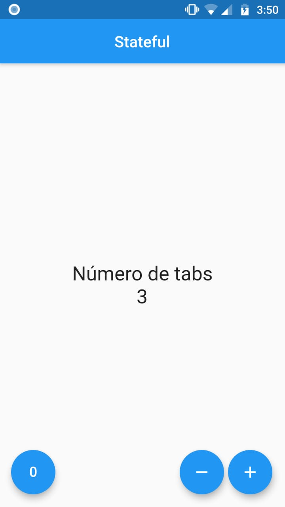

# Contador

Aplicación que maneja un StateFull Widget para manejar el estado de un contador, en esta Aplicación solo podemos sumar, restar e igualar a zero.

  

## Getting Started

Esté proyecto es un buen ejemplo para comenzar a familializarse en un aplicación a Flutter. Es necesario haber instalado [Flutter](https://flutter.dev/docs/get-started) posteriormente.

## A

## Requirements
  - Android Studio
  - Java JDK 8
  - Flutter
  - Plugins para Android Studio
    - Flutter
    - Dart
  - Emulador de android o dispositivo de android.

  - Se Recomienda usar Visual Studio Code, aunque se puede usar un android studio o cualquier otro editor de texto.
